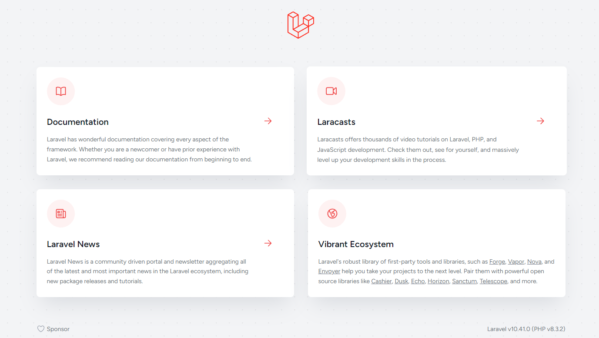

# Laravel Stack on Elestio

This is a minimal example of a Laravel Stack.

Click on the button below to deploy this repository with CI/CD on Elestio:

<a href="https://dash.elest.io/deploy?source=cicd&social=Github&url=https://github.com/elestio-examples/laravel"></a>



<br/>
<br/>

# Steps to clone this repository and run locally

### Step 1: Clone this repository

```
git clone YOUR_REPOSITORY_URL
```

### Step 2: Make some changes and push

Try to make some change in your Laravel project that is in `app` folder, then push to the git repository

After few seconds to few minutes your change will be deployed on your CI/CD target 🚀

# Production

To switch your environment to production, follow these steps within your CI/CD project on `elestio`:

1.  Navigate to the Tools tab and click on the `VS Code` button.

2.  In the opened Visual Studio Code environment, locate the `app > .env ` file within your Laravel project.

3.  Change `APP_ENV` value to `production`
